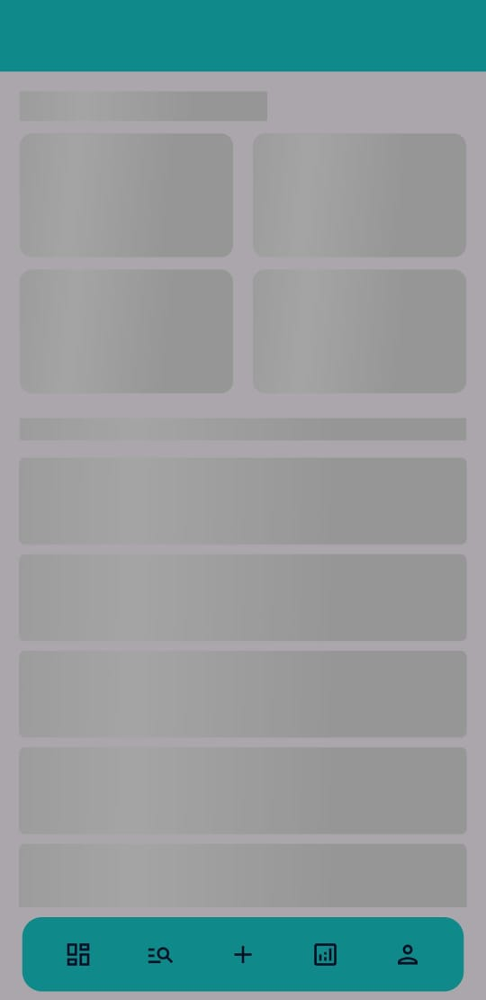
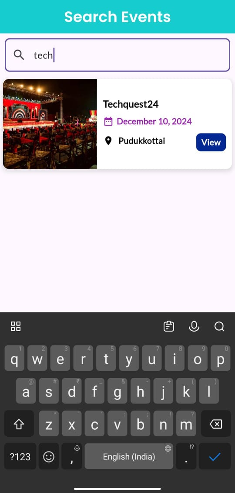

## $${\color{aqua}ORGANIZER - APP}$$

### Overview 
  - This app is a part of the **Event management system** . Organizer app plays an important role in event management software. Which helps to create and manage events.
  - This app is highly secure with enhanced UX. It supports real-time updates as well as updating the UI dynamically. 
---

### Features 
 - Enhanced event management software
 - organizer admin panel utility
 - Dynamic updates
 - lazy loading and shimmer loading screens
---

## Core Technologies

- **Flutter**: For crafting a high-quality, cross-platform user interface.
- **Dart**: Provides efficient backend logic and state management.
- **Firebase**:
  - **Firestore**: For storing events images and configuration information.
  - **Nodejs**: For API service.
- **Provider**: Simplifies state management across the application.

---
## APP OUTPUT SCREENS

<div style="display: flex; flex-wrap: wrap; gap: 10px; justify-content: center; height:100vh; width:100vw">

  <div style="display: flex; flex-direction: column; gap: 10px;">
    
    
  </div>

  <div style="display: flex; flex-direction: column; gap: 10px;">
    
    
  </div>

  <div style="display: flex; flex-direction: column; gap: 10px;">
    
    
  </div>

  <div style="display: flex; flex-direction: column; gap: 10px;">
    
    
  </div>

  <div style="display: flex; flex-direction: column; gap: 10px;">
    
    
  </div>

  <div style="display: flex; flex-direction: column; gap: 10px;">
    
    
  </div>

  <div style="display: flex; flex-direction: column; gap: 10px;">
    
    
  </div>

</div>

---


## Steps to Run
1. Clone the Repository
   ```bash
   git clone https://github.com/prasanth8961/organizer_app.git
   cd organizer_app
2. Install Flutter SDK
   link flutter installation Guide
   ```bash
   flutter doctor
3. Install Dependencies
   ```bash
   flutter pub get
4. Set up a Device
    Physical Device: Connect your Android or iOS device via USB and enable Developer Mode.
    Emulator: Set up an Android or iOS emulator in Android Studio or Xcode.
5. Run the App
    ```bash
   flutter run

6. Interact with the App
     Launch the app and grant location permissions.
     Make profile verified organizer without making it. Event creation is not possible.
     Your details is verified and now your a organizer. Now you can create and manage your events.
     Log your events status.
     Export logs in CSV or PDF format for external use.


## Contributing

Contributions are welcome to improve the project.

1. Fork the repository.
2. Create a new branch for your feature:
   ```bash
   git checkout -b feature/feature-name


License
This project is licensed under the MIT License.

For queries or support, please contact prasanth.appdev@gmail.com

Made with ❤️ by Prasanth

